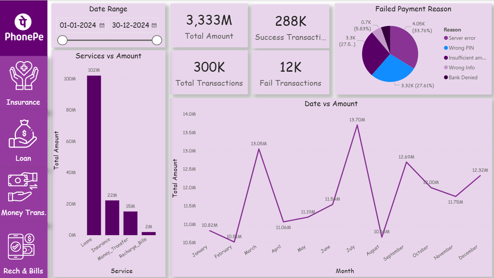

# 📊 Digital Payment Performance Dashboard

An interactive **Power BI dashboard** analyzing digital payment performance using a **PhonePe transaction dataset**.  
The project explores transaction trends, success rates, and failure patterns to uncover insights that help improve payment reliability and performance.

---

## 🚀 Project Overview

Digital payments generate massive transaction data every day.  
This project analyzes **12M+ digital payment records** to identify:

- Transaction success and failure patterns
- Category-wise contribution to total payments
- Monthly transaction trends
- Key factors impacting payment failures

The goal is to transform raw transaction data into **actionable business insights through data visualization and analytics**.

---

## 📂 Dataset

**Source:** PhonePe digital payment dataset  

- 📦 **12M+ transaction records**  
- 💰 **₹49M+ transaction volume**  
- 🧾 Multiple payment categories and transaction types  

---

## 🔍 Key Analysis

The dashboard focuses on the following analytical areas:

- 📈 Transaction volume trends over time  
- ✅ Success vs ❌ failure rate analysis  
- 🏷 Category-wise transaction contribution  
- 📊 Monthly digital payment trends  

---

## 💡 Key Insights

- Identified **96% overall transaction success rate**
- **Server errors accounted for 34% of payment failures**
- Certain transaction categories contributed significantly to overall volume
- Monthly trends reveal growth in digital payment adoption

---

## 🛠 Tools & Technologies

- **Power BI** – Data visualization and dashboard development  
- **DAX** – KPI calculations and dynamic metrics  
- **Power Query** – Data transformation and cleaning  

---

## 📊 Dashboard Preview

---

## 🎯 Project Outcome

The dashboard provides an **interactive view of digital payment performance**, enabling stakeholders to:

- Monitor transaction health
- Identify major failure drivers
- Track payment trends and KPIs
- Support **data-driven decision making**

---

## 👩‍💻 Author

**Sakshi Gaur**  
Data Analyst | Power BI • Python • SQL  

